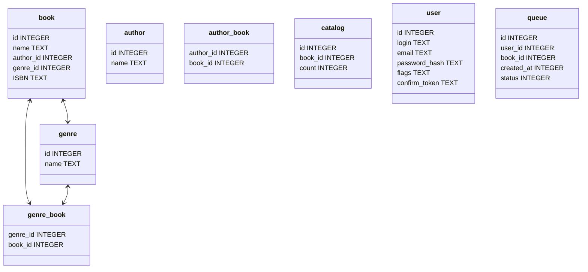
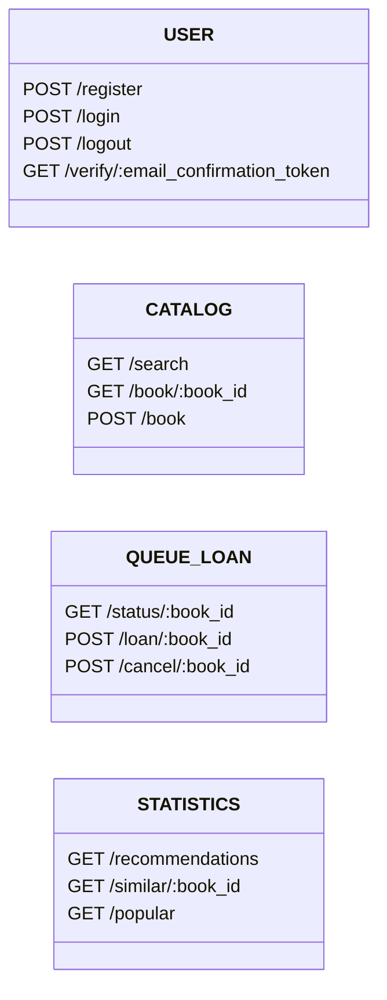

# Lib Service

# О проекте
Lib Service - Go - это проект, идея которого заключается в автоматизации работы библиотеки с использованием микро-сервисной архитектуры.

На данный момент проект включает в себя такие библиотеки, как:
* PostgreSQL
* kafka
* Docker


# Структура проекта
---
| № | Модуль | Описание | Выполняет |
|:-:|---|:---:|---:|
| 1 | api-gateway | Cервис является важным компонентом микро-сервисной архитектуры. Он обеспечивает единое взаимодействие между разными сервисами в приложении, которые могут работать независимо друг от друга. |  |
| 2 | catalog | Сервис для управления каталогом книг, который будет отвечать за хранение информации о книгах в библиотеке, их местонахождение и наличие. |  |
| 3 | account | Сервис для управления пользователями, который будет делиться на 2 модуля, первый будет отвечать за Регистрацию/Авторизацию(auth), а второй за управлевлением данными пользователей(user) | |
| 4 | loan | Сервис для управления займами, который будет отвечать за оформление займов книг читателями, продление займов и возврат книг. |  |
| 5 | queue | Сервис для управления очередью на книги, который будет отвечать за ведение списка читателей, ожидающих книгу, и обеспечивать выдачу |  |
| 6 | statistics | Сервис для управления аналитикой и статистикой, который будет отвечать за сбор и анализ данных о работе библиотеки, включая статистику о займах книг, общем количестве посетителей и т. д. * _**Данный сервис не является обязательным**_ |  |
| 7 | File & Email | Сервисы также _**не являются обязательными.**_ | |

# Структура базы данных


# REST API


# REST API Data
```
POST /register
FORM: {
    email,
    login,
    password
}

POST /login
FORM: {
    email,
    password
}

GET /search
FORM: {
    q // Поисковой запрос
}
```

# Json Web Token Payload
```
{
    user_id
}
```

# Наши контакты
Руководитель проекта -> [Юдин Александр Викторович](https://github.com/mireafullstack/)

Руководитель команды разработчиков -> [Аксенов Кирилл](https://github.com/Ki4EH/)

Разработчик -> [1](https://github.com/) \
Разработчик -> [1](https://github.com/) \
Разработчик -> [1](https://github.com/) \
Разработчик -> [1](https://github.com/) \
Разработчик -> [1](https://github.com/) \
Разработчик -> [1](https://github.com/) \
Разработчик -> [1](https://github.com/) \
Разработчик -> [1](https://github.com/) \
Разработчик -> [1](https://github.com/) \
Разработчик -> [1](https://github.com/) \
Разработчик -> [1](https://github.com/) \
Разработчик -> [1](https://github.com/) 


# Лицензия
